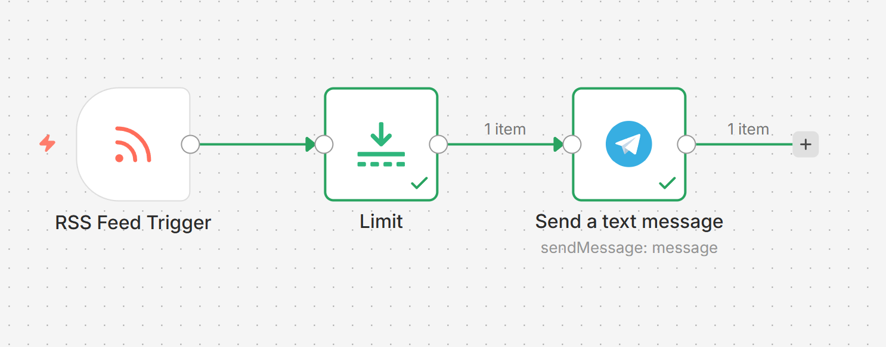
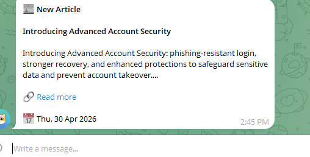

# 📡 New RSS Articles to Telegram — n8n Automation Workflow

An automated n8n workflow that monitors any RSS feed every 30 minutes and instantly delivers new articles as formatted messages to your Telegram chat — so you never miss a post from your favorite sources.

---

## 📌 Table of Contents

- [The Problem](#the-problem)
- [Why Automation?](#why-automation)
- [Impact of This Solution](#impact-of-this-solution)
- [What This Workflow Does](#what-this-workflow-does)
- [Workflow Overview](#workflow-overview)
- [Telegram Output](#telegram-output)
- [Tech Stack](#tech-stack)
- [Setup Guide](#setup-guide)
- [Workflow JSON](#workflow-json)

---

## The Problem

Staying informed in today's world means following dozens of sources — tech blogs, news outlets, company announcements, research feeds. The problem is that information is scattered across different websites, each with its own update schedule. Keeping up manually requires either visiting each site every day (easy to forget), relying on social media algorithms that filter content based on engagement rather than your interests, or subscribing to email newsletters that pile up and get buried.

For professionals, researchers, and developers who need to stay current in a specific domain — AI news, security advisories, industry updates — missing a key announcement can mean falling behind or missing time-sensitive information.

RSS feeds exist precisely to broadcast new content in a structured, machine-readable format. The problem is that reading RSS manually requires a dedicated reader app that most people don't maintain. The solution is to bring the content to where you already are: **Telegram**, which most people check dozens of times a day.

---

## Why Automation?

**RSS is structured data.** Every RSS feed returns articles in a consistent XML format with a title, link, date, and description. Mapping it to a message template is deterministic and requires no judgment.

**The trigger is event-based, not human-based.** New articles appear unpredictably throughout the day. A human checking manually will either check too often (wasted effort) or too rarely (missed articles). An automated poll every 30 minutes hits the right balance.

**Deduplication is handled automatically.** n8n's RSS Feed Trigger tracks which articles it has already processed and only fires for genuinely new items — something a manual process cannot guarantee.

**Telegram is already where you are.** By delivering articles to Telegram rather than a separate app, the workflow meets you in your existing flow. No new habit to build, no new app to check.

**It scales to any number of feeds at zero extra effort.** Adding a second or third source is just copying the trigger node — the rest of the workflow handles it identically.

---

## Impact of This Solution

| Dimension | Before Automation | After Automation | Impact |
|---|---|---|---|
| **Time** | 10–20 min/day visiting sites | 0 min — pushed to Telegram | Saves ~75 hours/year |
| **Coverage** | Only sources you remember to check | Every followed feed, every 30 min | Zero missed articles |
| **Timeliness** | Hours after publication | Within 30 minutes of publishing | Near real-time awareness |
| **Effort** | Active, requires remembering | Fully passive | Zero cognitive load |
| **Noise** | Algorithm-filtered social feeds | Direct from source, no filtering | 100% signal, no algorithm |
| **Scalability** | Linear — more sources = more effort | Flat — same effort for 1 or 20 feeds | Scales at no extra cost |
| **Cost** | Free (just your time) | $0/month (free tier tools) | No added cost |

For a researcher or developer following 5 sources, this automation reclaims approximately **1–2 hours per week** while improving coverage and timeliness simultaneously.

---

## What This Workflow Does

The workflow runs automatically every **30 minutes** and performs the following steps:

1. **RSS Feed Trigger** — Polls `openai.com/news/rss.xml` every 30 minutes. n8n automatically tracks which articles have been sent before and only processes new ones, preventing duplicates.

2. **Limit** — Caps the output to a maximum of **5 articles per run**. This prevents the Telegram chat from being flooded if a site publishes many posts at once (e.g. after a long silence or a batch publish event).

3. **Send a text message** — Formats each new article into a clean Markdown message containing the article title in bold, a 200-character content preview, a clickable "Read more" link, and the publication date. Sends it to the configured Telegram chat via bot.

---

## Workflow Overview

The complete n8n workflow with all three connected nodes:



> **Flow:** RSS Feed Trigger → Limit → Send a text message

| Node | Type | Role |
|---|---|---|
| RSS Feed Trigger | Trigger | Polls feed every 30 min, fires for new articles only |
| Limit | Utility | Caps articles per run to 5 — prevents Telegram flooding |
| Send a text message | Output | Formats and delivers each article to Telegram |

---

## Telegram Output

A sample of the message delivered to Telegram for each new article:



Each message contains:
- Article title in bold
- A short content preview (up to 200 characters)
- A clickable "Read more" link to the full article
- Publication date formatted as day, date, month, year

---

## Tech Stack

| Component | Tool / Service |
|---|---|
| Automation platform | [n8n](https://n8n.io) |
| Content source | Any RSS / Atom feed |
| Example feed | [OpenAI News](https://openai.com/news/rss.xml) |
| Delivery channel | Telegram (via Bot API) |
| Trigger | n8n RSS Feed Trigger (polls every 30 min) |

---

## Setup Guide

### Prerequisites

- An n8n instance (self-hosted or [n8n.io cloud](https://n8n.io))
- A Telegram account and bot token (see below)
- The RSS feed URL you want to follow

### 1 — Create a Telegram Bot

1. Open Telegram → search **@BotFather** → send `/newbot`
2. Follow the prompts to name your bot and get an **Access Token**
3. Start a chat with your new bot (search its username → click Start)
4. Get your **Chat ID** by messaging **@userinfobot** on Telegram

### 2 — Import and configure the workflow

1. In n8n, go to **Workflows → Import** → paste `New_RSS_articles_to_Telegram.json`
2. In the **RSS Feed Trigger** node → set your desired **Feed URL**
3. In the **Limit** node → adjust **Max Items** (default: 5)
4. In the **Send a text message** node — connect your Telegram bot credential, set your **Chat ID**, and confirm **Parse Mode** is set to `Markdown`
5. Toggle the workflow to **Active**

### RSS Feed URL Examples

| Source | Feed URL |
|---|---|
| OpenAI News | `https://openai.com/news/rss.xml` |
| TechCrunch | `https://techcrunch.com/feed/` |
| BBC News | `http://feeds.bbci.co.uk/news/rss.xml` |
| Al Jazeera (EN) | `https://www.aljazeera.com/xml/rss/all.xml` |
| NASA Breaking News | `https://www.nasa.gov/rss/dyn/breaking_news.rss` |
| Hacker News (Top) | `https://hnrss.org/frontpage` |

---

## Upgrades to Try Next

- **Multiple feeds** — Duplicate the RSS Feed Trigger for each source; merge with a Merge node before Limit
- **Keyword filter** — Add an IF node after the trigger to forward only articles matching a keyword (e.g. "GPT", "security")
- **AI summary** — Insert an OpenAI node between Limit and Telegram to rewrite the snippet as a 1-sentence summary
- **Archive to Notion** — Branch after Limit: one path to Telegram, another to a Notion database for permanent archiving

---

## Workflow JSON

The full workflow definition is in [`New_RSS_articles_to_Telegram.json`](./New_RSS_articles_to_Telegram.json). Import it directly into n8n to get started instantly.

---

## Project Structure

```
new-rss-articles-to-telegram/
├── README.md
├── New_RSS_articles_to_Telegram.json   # n8n workflow export
├── workflow_screenshot.png              # n8n canvas screenshot
└── telegram_screenshot.png             # Sample Telegram message
```

---

*Built with [n8n](https://n8n.io) — workflow automation for everyone.*
